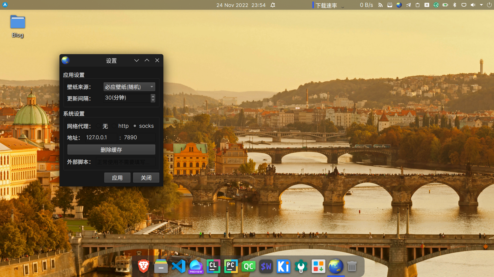
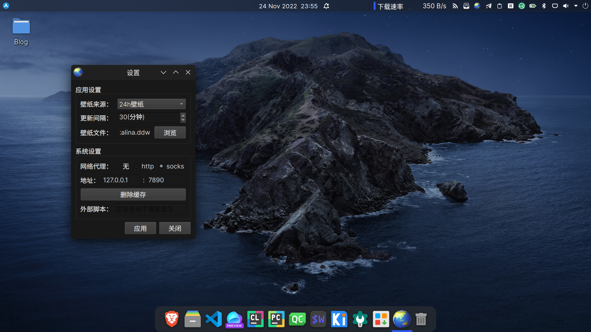
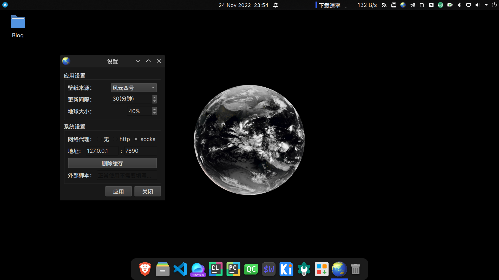
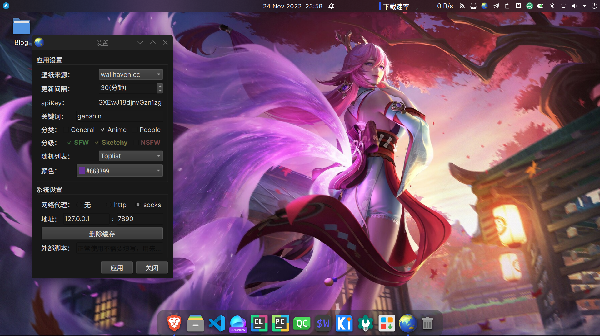

<p align="center">
  <a href="#">
  </a>
  <p align="center">
   
  </p>
  <h1 align="center"><b>earth-wallpaper</b></h1>
  <p align="center">
  简单好用的多功能壁纸软件
    <br />
  </p>
</p>
<div align="center">

[](https://github.com/ambition-echo/earth_wallpaper/releases)
[](https://github.com/ambition-echo/earth_wallpaper/releases)
[](https://github.com/ambition-echo/earth_wallpaper/blob/main/LICENSE)
[](https://github.com/ambition-echo/earth_wallpaper)

[](https://pypi.org/project/earth-wallpaper/)
[](https://aur.archlinux.org/packages/earth-wallpaper-bin)
[](https://aur.archlinux.org/packages/earth-wallpaper-nightly)
## [English](https://github.com/ambition-echo/earth_wallpaper/blob/main/docs/README.md)
</div>
<br/>

## 安装

### Linux

#### Debian

下载`earth-wallpaper-amd64.deb`后使用apt或dpkg安装

#### Arch

通过[AUR](https://aur.archlinux.org/packages?O=0&K=earth-wallpaper-)安装

```shell
# paru
paru -S earth-wallpaper-bin # or earth-wallpaper-nightly
# yay
yay -S earth-wallpaper-bin  # or earth-wallpaper-nightly
```

### Windows

Windows推荐使用pip安装
需要实现安装好python3

```shell
pip install earth-wallpaper # 安装
pip install earth-wallpaper --upgrade # 更新
```

## 使用须知

第一次运行时会弹出设置窗口，点击```应用```即可开始运行

## 支持接口

- [x] 向日葵八号
- [x] 风云四号
- [x] 必应壁纸 (调用 [@xCss](https://github.com/xCss/bing) API)
- [x] 动漫壁纸 (调用 [waifu.im](https://waifu.im/) API)
- [x] 本地壁纸 (注：目前Windows下使用本地壁纸，路径需要全英文且无空格)
- [x] 24h壁纸 (灵感来自于[windynamicdesktop](https://github.com/t1m0thyj/windynamicdesktop))
- [x] wallhaven.cc ([wallhaven.cc](https://wallhaven.cc))

> 24h壁纸推荐下载地址:
>
> [https://github.com/MiniBusiest/24Hour-Wallppe](https://github.com/MiniBusiest/24Hour-Wallppe)
>
> [https://windd.info/themes/index.html](https://windd.info/themes/index.html)

## 支持桌面环境

### Linux

- [x] KDE Plasma
- [x] Deepin
- [x] GNOME
- [x] ubuntu:GNOME
- [x] Cinnamon
- [x] XFCE
- [x] MATE
- [x] Cutefish
- [x] LXQt (pcmanfm-qt)
- [x] LXDE (pcmanfm)
- [x] 自定义脚本设置壁纸

### Windows

- [x] Windows 10 (测试环境：Windows 10 专业版 21H1，其他版本自行测试)

## 依赖

- Pillow
- PySide6
- requests
- setuptools
- pywin32 (Only Windows)

## 手动安装

```shell
git clone https://jihulab.com/ambition-echo/earth_wallpaper.git
cd earth_wallpaper
python3 setup.py install
```

## 开放API

bing 壁纸: [https://github.com/xCss/bing](https://github.com/xCss/bing)

waifu.im 动漫壁纸: [https://waifu.im/](https://waifu.im/)

ipapi 获取ip地理位置: [https://ipapi.co](https://ipapi.co)

wallhaven 壁纸: [https://wallhaven.cc/help/api](https://wallhaven.cc/help/api)

## 软件截图








